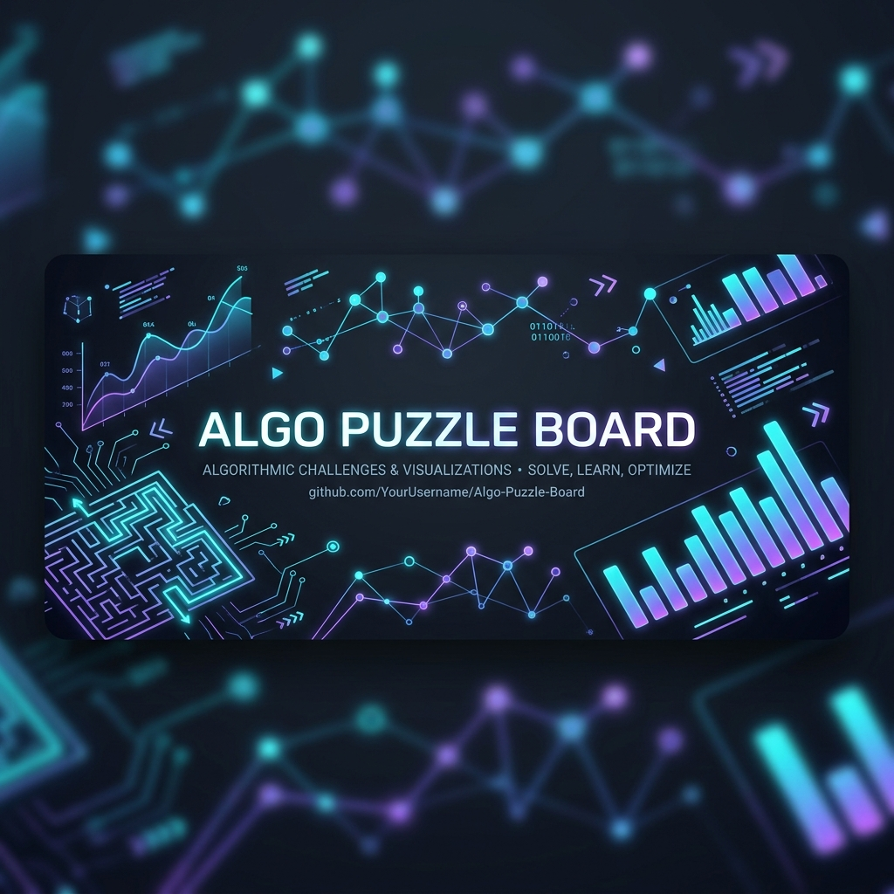
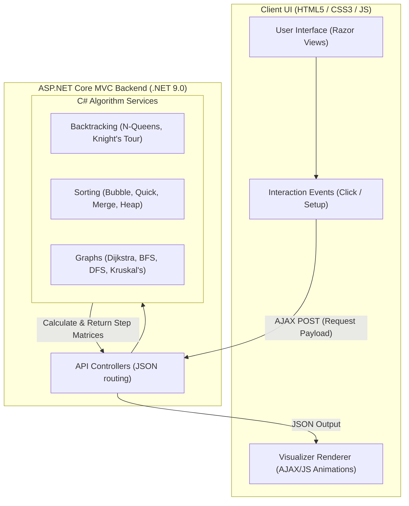

# 🧩 Algo Puzzle Board

[](https://learn.microsoft.com/en-us/dotnet/csharp/)
[](https://dotnet.microsoft.com/)
[](https://railway.app)
[](https://algo-puzzle-board-production-d547.up.railway.app/)

An interactive web application designed to make learning **Data Structures & Algorithms (DSA)** intuitive, visual, and highly engaging. By processing complex algorithm states in a high-performance **C# backend** and rendering real-time step-by-step animations in the frontend, this tool helps students and developers see algorithms in action rather than just reading theory.

---

<p align="center">
  
</p>

---

## 🗺️ Navigation Index

1. [🚀 Live Demo](#-live-demo)
2. [✨ Core Features](#-core-features)
3. [🏗️ Application Architecture](#%EF%B8%8F-application-architecture)
4. [📚 Algorithms & Concepts Catalog](#-algorithms--concepts-catalog)
5. [🖥️ Technical Architecture & Folder Structure](#%EF%B8%8F-technical-architecture--folder-structure)
6. [🔌 API Endpoints](#-api-endpoints)
7. [⚙️ How to Run Locally](#%EF%B8%8F-how-to-run-locally)
8. [🤝 Contribution guidelines](#-contributions)
9. [👥 Authors & Contributors](#-authors)

---

## 🔗 Live Demo

Experience the animations live:
👉 [Algo Puzzle Board on Railway](https://algo-puzzle-board-production-d547.up.railway.app/)

---

## ✨ Core Features

- **🎮 20+ Algorithm Visualizations:** Interactive simulations of puzzles, graphs, sorting, and data structure operations.
- **⚡ Real-time Step Animations:** Step-by-step control variables rendered dynamically in the UI.
- **🧠 Full C# Logic Solver:** 100% of calculations (including backtracking, shortest paths, and sort partitions) are solved in the backend to ensure performance and logical correctness.
- **🖱️ Click-based Puzzle Solvers:** Interact with boards (like placing chess queens or tracking knight steps) and see C# verify states live.

---

## 🏗️ Application Architecture

The system uses a fast C# controller API coupled with dynamic frontend rendering:



---

## 📚 Algorithms & Concepts Catalog

Explore the catalog of algorithm implementations:

<details>
<summary>🔢 1. Sorting Algorithms</summary>

- 🟩 **Bubble Sort:** Simple swap operations visualizer.
- 🔧 **Selection Sort:** Dynamic minimum item search.
- 🔧 **Insertion Sort:** Insertion loop visualizations.
- 🔧 **Merge Sort:** Divide-and-conquer segmentation logs.
- 🔧 **Quick Sort:** Pivot selection and list splits.
</details>

<details>
<summary>🌲 Data Structures</summary>

- 🔧 **Linear Arrays:** Access, search, and dynamic inserts.
- 🔧 **Stacks & Queues:** Visualized LIFO / FIFO queue entries.
- 🔧 **Linked Lists:** Pointer navigation tracking.
- 🔧 **Trees:** Binary Search Trees (BST), Min/Max Heap structural conversions.
</details>

<details>
<summary>🌐 Graph Algorithms</summary>

- 🔧 **BFS (Breadth-First Search):** Level-order search visuals.
- 🔧 **DFS (Depth-First Search):** Stack-based deep node traversal.
- 🔧 **Dijkstra's Shortest Path:** Node-by-node pathfinding metrics.
- 🔧 **Minimum Spanning Trees:** Kruskal's and Prim's algorithm states.
</details>

<details>
<summary>♟️ Puzzle & Backtracking Problems (Fully Visualized)</summary>

- 🟩 **N-Queens Problem:** Backtracking visual solver placing N non-attacking queens on a grid.
- 🟩 **Knight's Tour:** Visualizing Warnsdorff's heuristic for board traversal.
- 🟩 **Graph Coloring:** Dynamic node coloring solver minimizing overlaps.
</details>

*Legend: 🟩 Fully Implemented Visualizer | 🔧 C# Backend Ready / Logic Service completed.*

---

## 🖥️ Technical Architecture & Folder Structure

```text
AlgoPuzzleBoard.MVC/
├── Controllers/          # C# API Controllers (Maps HTTP JSON actions)
├── Services/             # C# Algorithm Services (Solves pathfinding, sorting, & puzzles)
├── Models/               # Core data structures and exchange models
├── Views/                # Razor View templates (Generates initial page containers)
├── wwwroot/              # Client assets
│   ├── css/              # Glassmorphic layout styling rules
│   └── js/               # AJAX network queries and visual animation drivers
├── Dockerfile            # Container definition for cloud deployments
└── Program.cs            # ASP.NET Application setup and entry point
```

---

## 🔌 API Endpoints

All services communicate using async HTTP POST queries returning JSON objects:

*   `POST /NQueens/Solve` - Solves backtracking layout states.
*   `POST /KnightsTour/SolveTour` - Traces the Warnsdorff heuristic path.
*   `POST /GraphColoring/SolveColoring` - Processes coloring nodes.
*   `POST /TSP/SolveTSP` - Generates optimized Traveling Salesperson route.
*   `POST /Huffman/BuildTree` - Formulates Huffman prefix maps.

---

## ⚙️ How to Run Locally

### Prerequisites
- Install [.NET 9.0 SDK](https://dotnet.microsoft.com/download)

### Run Steps
1. **Clone the repository:**
   ```bash
   git clone https://github.com/asad594/Algo-Puzzle-Board.git
   cd Algo-Puzzle-Board/AlgoPuzzleBoard.MVC
   ```

2. **Compile the solution:**
   ```bash
   dotnet build
   ```

3. **Launch the application:**
   ```bash
   dotnet run
   ```

4. **Access the interface:**
   Open your browser and navigate to:
   [http://localhost:5024](http://localhost:5024)

---

## 🤝 Contributions

Contributions, feature requests, and UI recommendations are welcome!
Feel free to fork the repository, make your modifications on a feature branch, and submit a Pull Request.

---

## 👥 Authors

This collaborative project was built by:
- **Muhammad Abdullah**
- **Muhammad Asad** ([@asad594](https://github.com/asad594))
- **Urooba Batool**
- **Shadaq Abdul Samad**

---

⭐ *If you find this project helpful for learning, don't forget to star the repository!*
